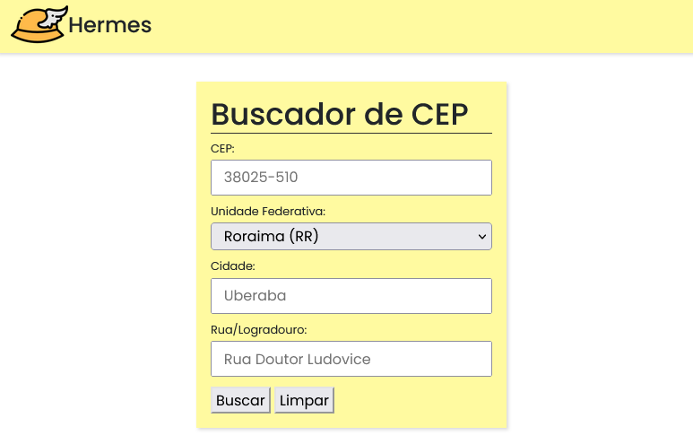

<h1 style="margin:0">Hermes - Buscador de CEP</h1>
<h3 style="margin:.5em 0">Curso Téc. Informática, 3º Período</h3> 
<h4 style="margin:0 0 1em 0">Prof.: Felipe Daher - 
Projeto Orientado (23/10/2023)</h4>

Quem nunca pediu algo pela internet e teve dificuldade em preencher o endereço por não saber o CEP?
 

O <em>Hermes</em> tem como objetivo consultar as informações de um CEP e também obtê-lo por meio das informações de UF, cidade e logradouro(rua).

Essa aplicação web client-side que utiliza a api "https://viacep.com.br", é bem simples e intuitiva de usar. Possui alguns filtros de expressões regulares nos inputs, prevenindo possíveis erros.

A estrutura principal da página é formada pelos seguintes arquivos:

<code>index.html</code> 
<code>style.css</code> 
<code>index.js</code>

* Para usar é só baixar o zip ou clonar o repositório e abrir no navegador.

Habilidades desenvolvidas no projeto:
* Trabalhando com os conceitos de API, requisição e resposta;
* DOM, Regex e ES6;
* Estilização de elementos com CSS e Bootstrap;
* HTML;

Aparência do site:

Info sobre a API: https://viacep.com.br/